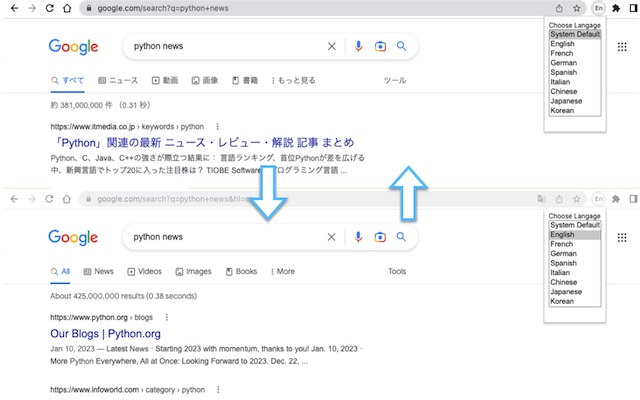

# forceeen
Force Choose Language to Result of Google Search. 
Google検索の結果を指定の言語で絞り込むよう検索クエリを調整するChrome拡張です。

通常、言語での検索結果絞り込みはすべての言語かシステム設定の言語での絞り込みのいずれかのみ選択可能ですが、検索クエリを調整することで指定言語での検索結果絞り込みを行えます。

これにより、例えば「英語サイトのみを検索対象とするよう結果を絞り込みたい、日本語サイトを除いて検索を行いたい」というケースに対応できます。 
また、英語以外にもいくつかの主要な言語を選択可能としています。
